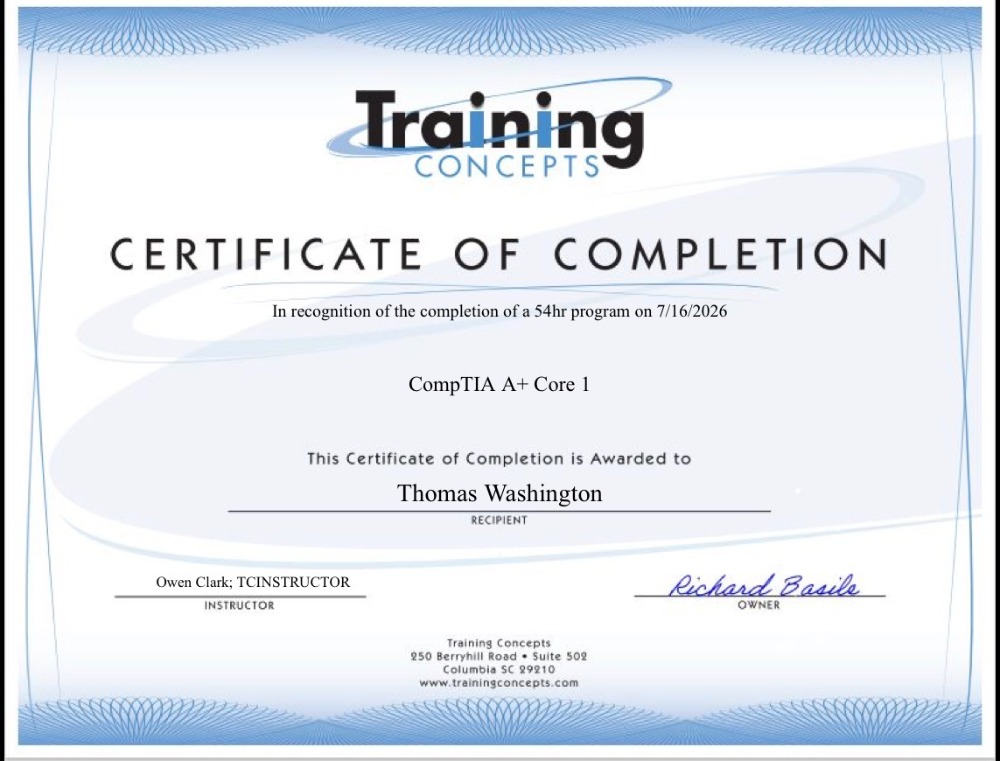
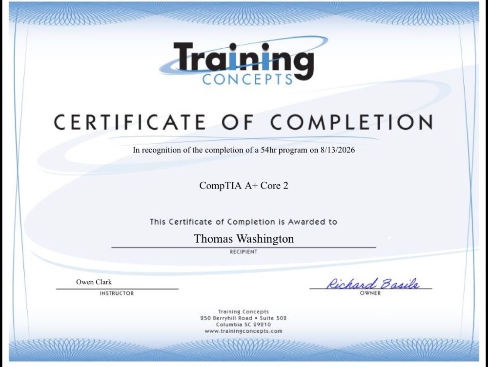
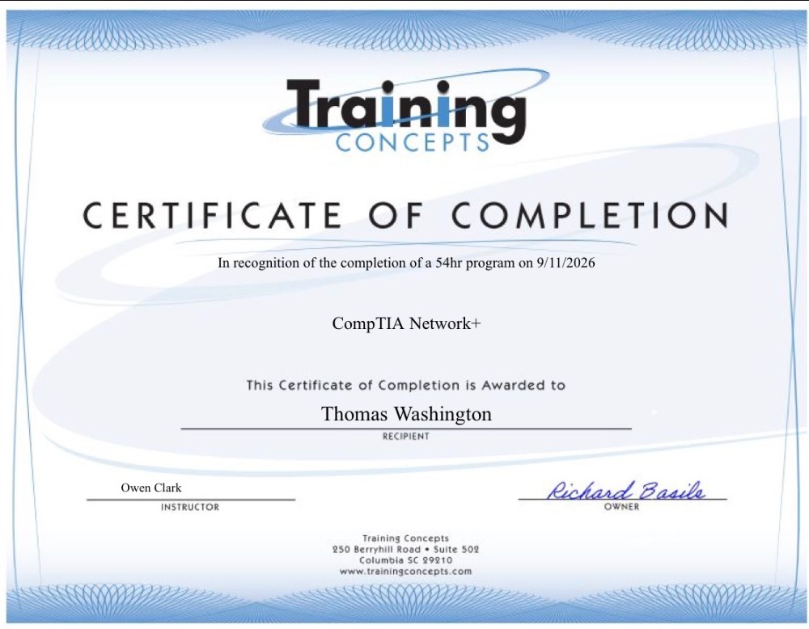

# Certifications and Technical Training

This section highlights industry certifications and structured technical
training completed as part of my professional development in information
technology, cybersecurity, networking, and technical support.

## Industry Certifications

### CompTIA Security+

Official CompTIA certification demonstrating foundational knowledge in:

- Cybersecurity
- Network security
- Risk management
- Security operations
- Threat identification
- Security controls

[View CompTIA Security+ Certificate](certifications/comptia-security-plus.pdf)

---

### CompTIA Linux+

Official CompTIA certification demonstrating knowledge in:

- Linux system administration
- Command-line tools
- User and permission management
- Networking
- Linux security
- System troubleshooting

[View CompTIA Linux+ Certificate](certifications/comptia-linux-plus.pdf)

---

### Splunk Core Certified User

Splunk Core Certified User certification demonstrating foundational skills in:

- Splunk search
- Fields and data
- Reports
- Dashboards
- Basic data analysis

**Expiration:** March 1, 2027

## Technical Training

### CompTIA A+ Core 1 Training

**Provider:** Training Concepts  
**Program Length:** 54 hours  
**Completed:** July 16, 2026

Training focused on foundational IT support topics including:

- Computer hardware
- Mobile devices
- Networking fundamentals
- Hardware troubleshooting
- Virtualization and cloud concepts

---

### CompTIA A+ Core 2 Training

**Provider:** Training Concepts  
**Program Length:** 54 hours  
**Completed:** August 13, 2026

Training focused on:

- Windows operating systems
- Software troubleshooting
- Security
- Operational procedures
- Technical support

---

### CompTIA Network+ Training

**Provider:** Training Concepts  
**Program Length:** 54 hours  
**Completed:** September 11, 2026

Training focused on:

- Networking concepts
- Network infrastructure
- Network operations
- Network security
- Network troubleshooting

## Portfolio Purpose

These certifications and training programs support the hands-on projects,
home lab activities, troubleshooting exercises, and technical documentation
included throughout this repository.