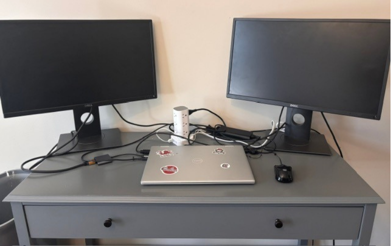
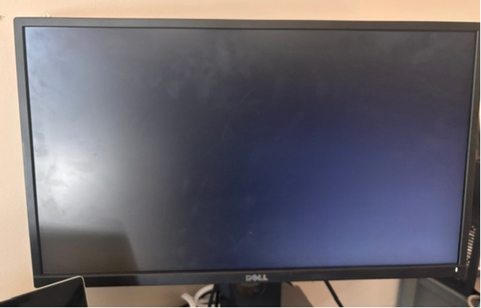
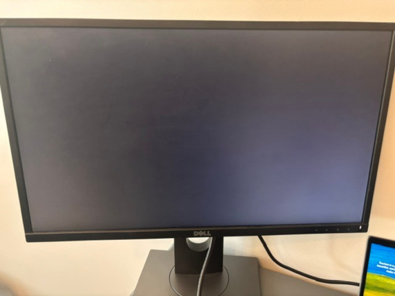
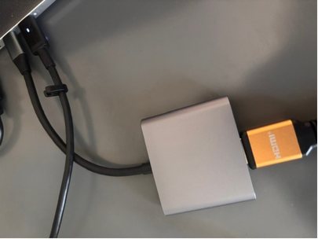
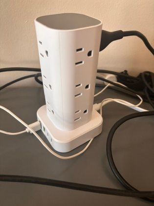

## Home Lab Setup

### Workstation Overview

Dual-monitor workstation used for IT practice, troubleshooting, coursework,
documentation, and technical projects.

### Monitor Setup

Two Dell external monitors are used to support multitasking, technical labs,
documentation, research, and troubleshooting activities.

### USB-C to HDMI Connectivity

USB-C to HDMI connectivity is used to connect the laptop to external displays
as part of the workstation configuration.

### Power and Cable Management

A multi-device surge protector/power station supports the workstation equipment
and peripherals.

### Peripheral Equipment

External mouse used as part of the workstation setup for daily IT lab and
technical support activities.